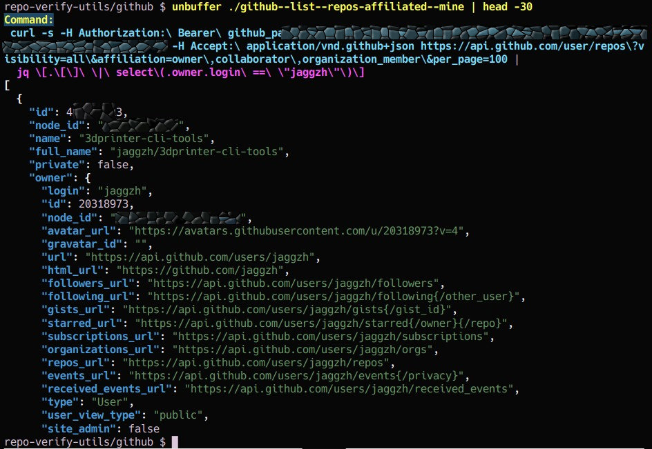

# repo-verify-utils
A utility collection to help examine what repositories and scopes your GitHub identity has access to.

---

## Overview

With the shift toward using agents, automation tools, cloud editors, etc. --
that act on your behalf -- you may be granting GitHub access to more than you
realize. This repository provides small, inspectable Bash utilities that help
you see what repos your credentials can access — including repos you don't own
but can still affect.

It’s designed to be simple, transparent, and shell-native.

Initial utilities are focused on GitHub (and use bash) and assume you’re using
a `GH_TOKEN` with appropriate API access, and `GH_LOGIN` set to
your username).



---

## Issues:
 - The $GH_TOKEN display in commands is supposed to be redacted, but it's not working --
   **SO DON'T PASTE YOUR OUTPUT FROM THESE SCRIPTS TO OTHER PEOPLE**
 - I just set this up. We probably need to reference the shell script location
   so it will source its utility routines scripts from the proper paths. **For
   now, run the scripts from here in your clone of the repo.**
 - Need to make a `-C` option so piping will retain `jq` syntax highlighting.

---

## Example: List Repos You Can Access but Don’t Own

```bash
github/github--list--repos-affiliated--not-mine | less
```

**Tip**: use `bat` instead of `less` if you want color to go across lines

## Example: List Repos You Own

```bash
github/github--list--repos-affiliated--mine | less
```

---

## Usage

Clone or symlink this repo and run utilities directly. You can either:

### Option 1: Run in place
```bash
git clone https://github.com/yourname/repo-verify-utils.git
cd repo-verify-utils/github
export GH_TOKEN=ghp_yourTokenHere
export GH_LOGIN=yourusername
./github--list--repos-affiliated--not-mine
```

### Option 2: Symlink into your `$PATH`
```bash
ln -s ~/repo-verify-utils/github/github--list--repos-affiliated--not-mine ~/bin/
github--list--repos-affiliated--not-mine
```

---

## Files

* `ansi.sh`:
 Color/formatting utility functions used across scripts.

* `repofns.sh`: Helper functions including:
  - Color print helpers (`asection`, `awarn`, etc.)
  - `github_env_verify` – checks if `GH_TOKEN` and `GH_LOGIN` are set

* `github/github--list--repos-affiliated--mine`:
 Lists all affiliated GitHub repos that **you own**.

* `github/github--list--repos-affiliated--not-mine`:
 Lists all affiliated GitHub repos that **you do not own**, i.e., where you're
 a collaborator or org member.

* `github/zz--set-env--GH_LOGIN--to-your-username`:
 Convenience script for setting the `GH_LOGIN` environment variable.

* `github/zz--set-env--GH_TOKEN`:
 Convenience script for setting the `GH_TOKEN` environment variable.

---

## Requirements

* Bash (for now)
* `curl`
* `jq`
* (optional but recommended) [`bat`](https://github.com/sharkdp/bat) for colorized output

---

## Goals

* Help users explore what repos their token/identity can modify or access
* Make GitHub API interaction easy and safe to inspect
* Avoid accidental exposure or unintended permissions
* Encourage review of OAuth app scopes and access boundaries

---

## Future Plans (chatgpt made this up):

* Add support for org/team listings
* Classify access by permission level (push/admin/etc.)
* Add GitHub Apps / OAuth audit helpers
* Optional HTML/JSON output modes
